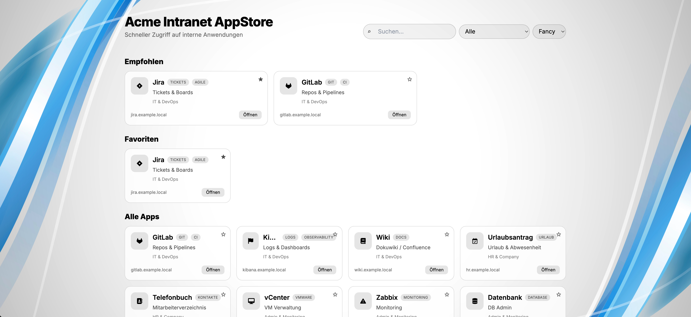

# Intranet AppStore

A simple static **Intranet Startpage** in an AppStore look.  

Built with plain HTML, TailwindCSS, Font Awesome & Lucide icons.  

Configuration is fully done via JSON – no build step, no frameworks required.



## Features

- 📁 Configurable via `intranet_config.json`
- 🔎 Search bar with instant filtering
- 🗂️ Category selection
- ⭐ Favorites (stored in LocalStorage)
- 🎯 Recommended apps section
- 🎨 Configurable backgrounds (defined in JSON, selectable via dropdown, persisted in LocalStorage)
- ⚡ Static files only – works on any web server (Apache, Nginx, S3, GitHub Pages, …)

## Getting Started

1. Clone or download this repository
2. Place `index.html` and `intranet_config.json` in the same directory
3. Run a static web server

### Example with Python

```bash
python3 -m http.server 8080
```

Open [http://localhost:8080/index.html](http://localhost:8080/index.html)

### Example with UBI (Red Hat Universal Base Image)

```bash
docker run -it --rm --name httpd   -p 8080:8080   -v $(pwd):/var/www/html:Z   registry.access.redhat.com/ubi8/httpd-24
```

## Configuration

All content is defined in **`intranet_config.json`**.

### Example

```json
{
  "title": "Acme Intranet AppStore",
  "subtitle": "Quick access to internal apps",
  "backgrounds": [
    { "name": "White", "file": "" },
    { "name": "Datacenter", "file": "dc.jpg" },
    { "name": "Cloud", "file": "clouds.jpg" }
  ],
  "defaultBackground": "White",
  "featured": ["Jira", "GitLab"],
  "categories": [
    {
      "name": "IT",
      "links": [
        {
          "title": "Jira",
          "url": "https://jira.example.local",
          "icon": "Kanban",
          "description": "Tickets & boards for teams and projects",
          "tags": ["tickets", "agile"]
        },
        {
          "title": "GitLab",
          "url": "https://gitlab.example.local",
          "icon": "GitBranch",
          "description": "Repositories, merge requests and CI/CD pipelines",
          "tags": ["git", "ci"]
        }
      ]
    }
  ]
}
```

## Icons

- **Lucide icons**: use the icon name, e.g. `"Server"`, `"GitBranch"`, `"Kanban"`.
- **Font Awesome**: use the class string, e.g. `"fa-solid fa-database"`.

## Backgrounds

- Backgrounds are defined in the JSON under `backgrounds`.
- One option can be set as `"file": ""` → will default to **plain white**.
- The dropdown selection is stored in LocalStorage and will persist across sessions.

## Deployment

Simply serve the two files (`index.html` + `intranet_config.json`) via any static web server:  
- Apache / Nginx  
- AWS S3 + CloudFront (static website hosting)  
- GitHub Pages  
- GitLab Pages  

## License

MIT License
